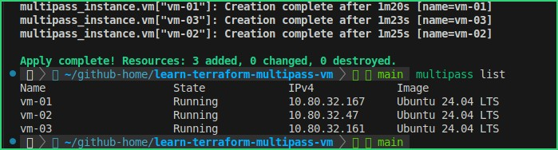

# Learn Terraform Multipass VM
Laboratorio base per creare macchine virtuali Ubuntu con **Terraform** e **Multipass**.

L'obiettivo del progetto è usare Terraform per creare e gestire 3 VM locali Multipass su Ubuntu.



## Obiettivo del laboratorio

Il laboratorio crea le seguenti VM:

| Nome  |     Immagine | CPU | RAM | Disco |
| ----- | -----------: | --: | --: | ----: |
| vm-01 | Ubuntu 24.04 |   1 |  1G |    5G |
| vm-02 | Ubuntu 24.04 |   1 |  1G |    5G |
| vm-03 | Ubuntu 24.04 |   1 |  1G |    5G |

Gli indirizzi IP vengono mostrati tramite output Terraform.

## Prerequisiti

Sul sistema devono essere installati:

* Git
* Multipass
* Terraform
* KVM abilitato

Verifica Multipass:

```bash
multipass version
multipass list
```

Verifica Terraform:

```bash
terraform version
```

Verifica KVM:

```bash
sudo kvm-ok
```

Output atteso:

```text
INFO: /dev/kvm exists
KVM acceleration can be used
```

## Struttura del progetto

```text
.
├── .gitignore
├── .terraform.lock.hcl
├── README.md
├── main.tf
├── outputs.tf
├── providers.tf
├── terraform.tfvars
├── variables.tf
└── versions.tf
```

Descrizione dei file principali:

| File               | Descrizione                                                       |
| ------------------ | ----------------------------------------------------------------- |
| `versions.tf`      | Definisce la versione minima di Terraform e il provider Multipass |
| `providers.tf`     | Configura il provider Multipass                                   |
| `main.tf`          | Definisce le risorse Multipass da creare                          |
| `variables.tf`     | Definisce le variabili Terraform                                  |
| `terraform.tfvars` | Contiene i valori del laboratorio                                 |
| `outputs.tf`       | Mostra gli IP delle VM create                                     |
| `.gitignore`       | Esclude file locali e state Terraform                             |

## Provider Terraform

Il laboratorio usa il provider:

```hcl
larstobi/multipass
```

La risorsa usata per creare le VM è:

```hcl
multipass_instance
```

## Inizializzazione del progetto

Eseguire:

```bash
terraform init
```

Oppure, se è stato creato un alias:

```bash
tf init
```

## Validazione

Controllare la formattazione:

```bash
terraform fmt
```

Validare la configurazione:

```bash
terraform validate
```

Output atteso:

```text
Success! The configuration is valid.
```

## Piano di esecuzione

Visualizzare cosa Terraform vuole creare:

```bash
terraform plan
```

Output atteso prima della creazione:

```text
Plan: 3 to add, 0 to change, 0 to destroy.
```

## Creazione delle VM

Applicare la configurazione:

```bash
terraform apply
```

Confermare con:

```text
yes
```

Output atteso:

```text
Apply complete! Resources: 3 added, 0 changed, 0 destroyed.
```

## Verifica con Multipass

Controllare le VM create:

```bash
multipass list
```

Output atteso:

```text
Name                    State             IPv4             Image
vm-01                   Running           10.x.x.x         Ubuntu 24.04 LTS
vm-02                   Running           10.x.x.x         Ubuntu 24.04 LTS
vm-03                   Running           10.x.x.x         Ubuntu 24.04 LTS
```

## Verifica dello state Terraform

Mostrare le risorse gestite da Terraform:

```bash
terraform state list
```

Output atteso:

```text
multipass_instance.vm["vm-01"]
multipass_instance.vm["vm-02"]
multipass_instance.vm["vm-03"]
```

## Visualizzare gli IP

```bash
terraform output vm_ips
```

Output atteso:

```text
{
  "vm-01" = "10.x.x.x"
  "vm-02" = "10.x.x.x"
  "vm-03" = "10.x.x.x"
}
```

## Accesso alle VM

Entrare in una VM:

```bash
multipass shell vm-01
```

Eseguire un comando senza entrare nella shell:

```bash
multipass exec vm-01 -- hostname
```

Esempio per tutte le VM:

```bash
multipass exec vm-01 -- hostname
multipass exec vm-02 -- hostname
multipass exec vm-03 -- hostname
```

## Test di rete tra VM

Esempio:

```bash
multipass exec vm-01 -- ping -c 3 <IP_VM_02>
```

Gli IP possono essere letti con:

```bash
terraform output vm_ips
```

## Stop e start manuale di una VM

Fermare una VM:

```bash
multipass stop vm-03
```

Riavviare una VM:

```bash
multipass start vm-03
```

Nota: se una VM è spenta, Multipass può non mostrare l'indirizzo IPv4. Terraform può quindi vedere una differenza solo negli output, senza ricreare la VM.

## Controllo drift

Verificare che l'infrastruttura reale corrisponda alla configurazione Terraform:

```bash
terraform plan
```

Output atteso quando tutto è allineato:

```text
No changes. Your infrastructure matches the configuration.
```

## Distruzione del laboratorio

Per eliminare tutte le VM create da Terraform:

```bash
terraform destroy
```

Confermare con:

```text
yes
```

Verifica finale:

```bash
multipass list
```

Output atteso:

```text
No instances found.
```

## File da non committare

Non committare:

```text
.terraform/
terraform.tfstate
terraform.tfstate.*
```

Questi file sono esclusi tramite `.gitignore`.

Il file `.terraform.lock.hcl` invece va committato, perché blocca la versione del provider usata dal progetto.

